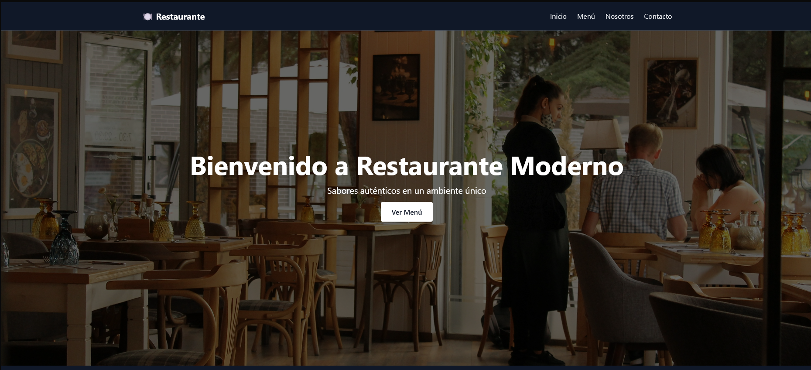

# Restaurante Moderno 🍽️

Landing page responsive y optimizada para un restaurante moderno, desarrollada con [Astro](https://astro.build/) y [Tailwind CSS](https://tailwindcss.com/).

## 🧑‍🍳 Descripción

Este proyecto es una landing page de una sola página, con secciones clave como:

- Hero principal con llamada a la acción
- Sección "Sobre Nosotros"
- Menú destacado (usando componentes de Astro)
- Formulario de contacto funcional vía Formspree
- Footer con enlaces y redes sociales
- Soporte para modo oscuro

## 🚀 Tecnologías

- Astro
- Tailwind CSS
- HTML/JS
- Formspree (para el formulario)

## 📦 Instalación

```bash
git clone https://github.com/frontendbyale/Restaurant-landing.git
cd Restaurant-landing
npm install
npm run dev
```

> Asegurate de tener Node.js instalado.

## ✉️ Formulario de contacto

Este sitio usa [Formspree](https://formspree.io/) para enviar mensajes sin backend propio.

## 🌐 Deploy Demo

[Restaurante_Moderno](https://restomoderno.netlify.app)

## 📸 Vista previa


